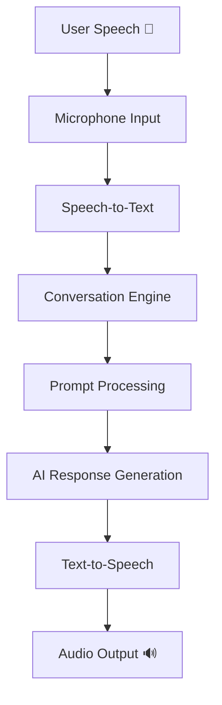
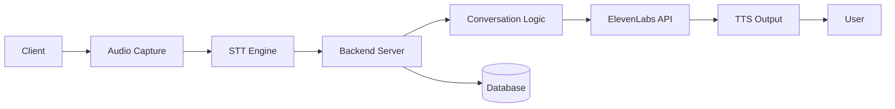

# Voice Virtual Assistant using ElevenLabs API

## Overview

This project is a real-time **Voice Virtual Assistant** built using Python and the ElevenLabs API. It enables seamless voice interaction by capturing user speech, processing it intelligently, and responding with natural AI-generated voice.

The assistant also includes a **basic scheduling feature**, allowing users to query their daily activities using voice commands.

---

## Features

* Real-time voice input via microphone
* Natural text-to-speech responses
* Context-aware conversations using prompt engineering
* Voice-based scheduling assistant
* Secure API key management using `.env`
* Lightweight and extensible architecture

---

## Tech Stack

* **Python**
* **ElevenLabs API (Conversational AI + TTS)**
* **dotenv**
* **PyAudio / Audio Interface**

---

## Architecture Diagram



---

## System Design



---

## ⚙️ Setup Instructions

### Install Dependencies

```bash
pip install elevenlabs python-dotenv pyaudio
```

---

### Create `.env` File

```env
AGENT_ID=your_agent_id
API_KEY=your_api_key
```

---

### Configure ElevenLabs Agent

* Create an agent in ElevenLabs
* Add custom system prompt (for scheduling)
* Enable:

  * First message override
  * System prompt override
* Click **Publish**

---

### Run the Application

```bash
python main.py
```

---

## Usage

Speak into your microphone and ask:

* “What do I have this afternoon?”
* “Tell me my schedule”
* “What’s next in my day?”

---

## Stop the Assistant

Press:

```bash
Ctrl + C
```

## Future Enhancements

* Wake word detection (“Hey Assistant”)
* ChatGPT integration
* GUI/Desktop interface
* Real-time calendar integration
* Mobile/Web deployment

---
